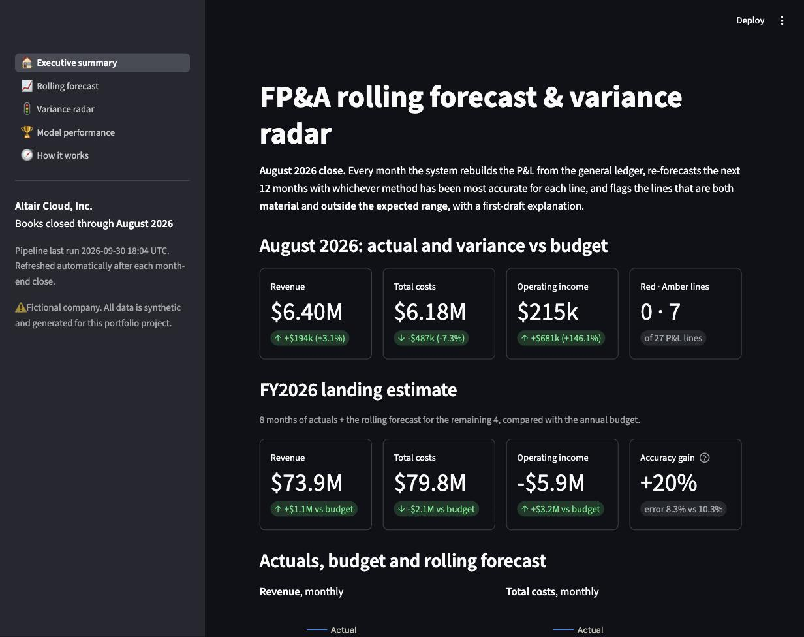
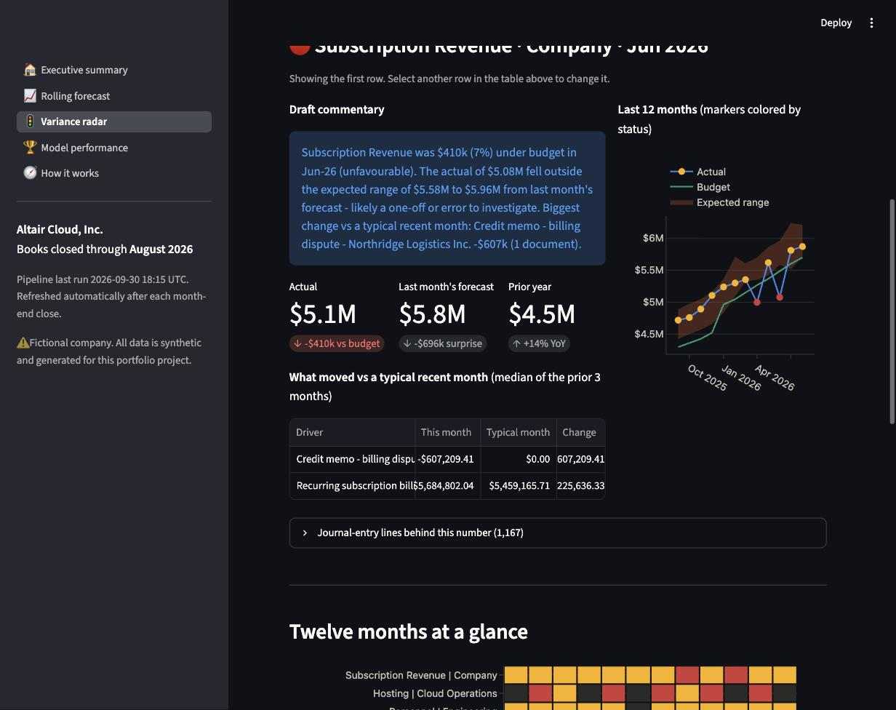
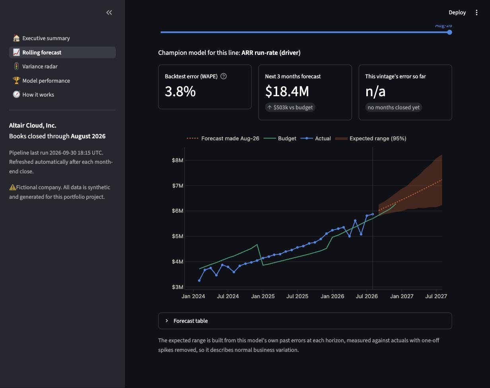
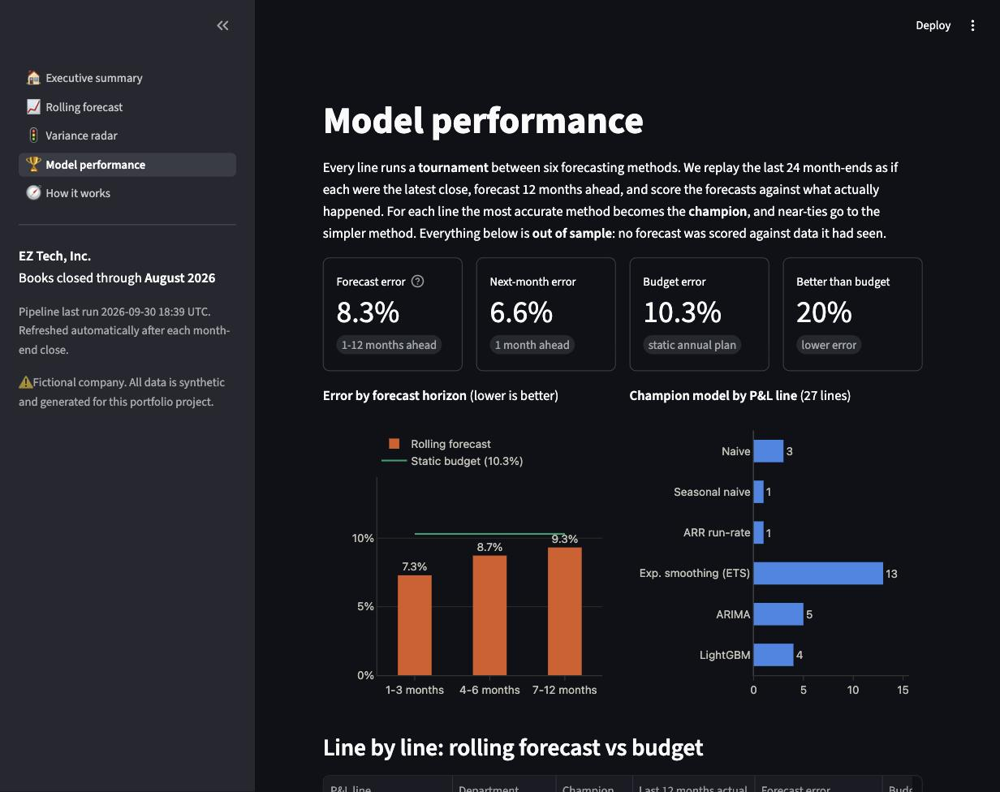
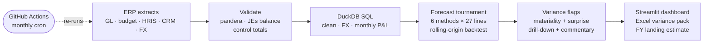

# FP&A Rolling Forecast & Variance Radar

[](https://github.com/eziquiolobao/FPA-ML-Forecast/actions/workflows/ci.yml)
[](https://github.com/eziquiolobao/FPA-ML-Forecast/actions/workflows/monthly_close.yml)
[](https://fpa-ml-forecast.streamlit.app)

**▶ Live dashboard: [fpa-ml-forecast.streamlit.app](https://fpa-ml-forecast.streamlit.app)**  
<sub>Hosted free on Streamlit Community Cloud. If it has been idle it may take ~30 seconds to wake up.</sub>

An end-to-end analytics project for **Financial Planning & Analysis (FP&A)**. It covers everything from a raw ERP general-ledger extract to a deployed dashboard that updates itself every month.

> Every month, after the books close, the system rebuilds the P&L from the ledger. It re-forecasts the next 12 months with whichever method has been most accurate for each line, and flags the lines that are both **material** and **outside the expected range**. Each flag comes with a first-draft explanation for the budget owner.

*All data is synthetic, generated for a fictional B2B SaaS company ("EZ Tech, Inc.").*

---

## Why this matters

Finance teams close the books every month and then answer two questions under time pressure:
1. **Where will the company land this year?** The annual budget is set once, in November, and goes stale quickly.
2. **Which numbers are off, and why?** Scanning dozens of lines against budget by hand is slow, and the one-off error hides among normal noise.

This project automates the first pass on both.

## Headline results (Aug-2026 close, out of sample)

| | Result |
|---|---|
| Rolling-forecast accuracy vs the static budget | **20% lower error** (WAPE 8.3% vs 10.3%, all 27 lines, 1-12 months ahead) |
| ... for the next quarter (1-3 months ahead) | **29% lower error** (7.3% vs 10.3%) |
| Injected accounting problems caught by Red flags | **12 of 13 (92% recall)**, and **82% of Red flags** were real problems |
| Review workload | about **1-2 Red lines a month** out of 27 |
| GL → P&L reconciliation | **$0.00** difference; every journal entry balances |
| Running cost | **$0**: open-source stack, GitHub Actions, Streamlit Community Cloud |

The live dashboard always shows the latest month's numbers. The table above is a snapshot.

## Screenshots

| Executive summary | Variance radar: a Red flag, explained |
|---|---|
|  |  |
| **Rolling forecast with expected range** | **Model tournament results** |
|  |  |

## What's inside



| Step | What happens | Where |
|---|---|---|
| **1. Synthetic ERP data** | About 89k journal-entry lines shaped like a NetSuite/SAP extract, plus chart of accounts, cost centers, FX, annual budgets, HR headcount and CRM ARR. Every journal entry balances; accruals reverse; payroll, bonuses and commissions post realistically. It includes **deliberate messiness** (extract duplicates, missing cost centers, inconsistent text) and a **hidden answer key** of injected anomalies. | `src/fpa/generate/` |
| **2. Validate** | Schema checks (pandera), journal-entry balance, reconciliation to the ERP's control totals, and a data-quality report. Nothing is dropped silently. | `src/fpa/ingest.py` |
| **3. Transform** | dbt-style staging → marts in **plain SQL on DuckDB**: de-dupe, impute cost centers, translate FX, build the monthly P&L by line × department. The pipeline fails if the P&L doesn't tie to the ledger. | `sql/`, `src/fpa/transform.py` |
| **4. Forecast** | A **rolling-origin backtest** over 24 month-ends. Six contenders: Naive, Seasonal Naive, an **ARR run-rate driver model**, AutoETS, AutoARIMA and a global **LightGBM** that uses the **hiring plan** as a known future input. One-off spikes are dampened with a robust STL decomposition before training. The champion per line is chosen using only past errors, with ties going to the simpler model. Expected ranges come from each champion's own error history. | `src/fpa/forecast/` |
| **5. Flag & explain** | 🔴 Red means material vs budget **and** outside the expected range. 🟠 Amber means material but expected, a small surprise, or a 3-month drift. Each flag gets its top drivers (spend items, customers, postings), a headcount-vs-rate split for payroll, and **template-based commentary** (no paid LLM). Thresholds live in `config/variance_rules.yaml`. | `src/fpa/variance/` |
| **6. Report** | An Excel variance pack for budget owners (summary, one tab per department, FY outlook) and a 5-page Streamlit app. | `src/fpa/reporting/`, `app/` |
| **7. Automate** | CI (ruff + pytest) on every push. A **monthly cron** runs the close, commits refreshed marts, and the dashboard redeploys itself. | `.github/workflows/` |

### Notebooks (the analysis story)
1. [`01_data_exploration`](notebooks/01_data_exploration.ipynb): the raw extract, data quality, the P&L, seasonality, drivers, and how wrong the budget has historically been.
2. [`02_forecast_backtesting`](notebooks/02_forecast_backtesting.ipynb): the tournament, accuracy vs budget by horizon, forecast vintages, an **honest look at bias**, and the full-year landing estimate.
3. [`03_variance_analysis`](notebooks/03_variance_analysis.ipynb): the radar, drill-downs, and **precision/recall against the answer key**, including the misses.

## Run it locally

Requires [uv](https://docs.astral.sh/uv/) (it installs Python 3.12 for you).

```bash
make setup      # uv sync
make pipeline   # generate -> validate -> transform -> forecast -> flag -> report  (~3 min)
make test       # 23 tests: determinism, double entry, penny tie-out, rules, headline claims
make app        # open http://localhost:8501
```

Run a different close with `uv run python -m fpa.pipeline run --as-of 2026-05`, or use `--as-of auto` for the last completed month.

## Repository layout

```
config/          settings.yaml (as-of, horizons), variance_rules.yaml (materiality thresholds)
sql/             staging/ and marts/ SQL models run on DuckDB
src/fpa/         generate/ · ingest.py · transform.py · forecast/ · variance/ · reporting/ · pipeline.py
notebooks/       01-03 analysis notebooks (executed, outputs included)
app/             Streamlit dashboard (reads data/marts only)
data/marts/      small parquet outputs committed for the app (raw data is regenerated, not committed)
reports/         monthly Excel variance pack
tests/           pytest suite
docs/            data_dictionary.md, images/
```

## Design choices worth discussing

- **Tournament, not a favourite model.** Rent is best forecast by "same as last month", marketing by a seasonal model, and revenue by the ARR driver. Exponential smoothing wins 13 of 27 lines; no model wins everywhere.
- **Honest evaluation.** Every accuracy number is out of sample, including the *choice* of champion at each month-end.
- **Materiality × surprise.** FP&A thresholds alone flag too many predictable gaps (e.g. hiring running behind plan). Statistical surprise alone flags immaterial noise. The combination keeps the Red list short and precise.
- **Measured, not asserted.** The data generator plants anomalies in a hidden answer key, so the flagging gets a real precision/recall score.
- **Known limitation.** Costs are under-forecast by a few percent during a 2026 hiring acceleration, and revenue runs low 9-12 months out after a price increase. Both are documented in notebook 02, with proposed fixes (a driver-based personnel model, overlaying known decisions, and bias correction).

## Tech stack

Python 3.12 · pandas · DuckDB · pandera · statsforecast / mlforecast (Nixtla) · LightGBM · statsmodels · Plotly · Streamlit · openpyxl · pytest · ruff · uv · GitHub Actions
